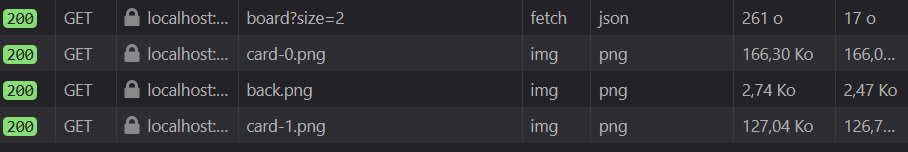

# Javascript SPA 

MAGYAR Corentin
SUTHARSAN Vithusan

utilisation de babel / webpack / node.js / ESnext

**1. While going through the 3 views of the application, how many files did your browser download in total? What was the total size of transfered data?**

**Welcome View - 220 Ko**

**Game View - 300 Ko**

**Score View - 230 Ko**

Au total 21 fichiers sont chargés lors de l’exécution du jeu ce qui représente environ 750 Ko.
On remarque qu’à chaque vue de nombreux fichiers sont chargés alors qu’ils ne pourraient être chargés qu’une seule fois (style.css, bootstrap.css, logo…).

**2. Component-oriented programming for the web is considered more maintainable. Why?**

Les composants sont indépendants les uns des autres, ce qui permet par exemple de les réutiliser dans d’autres applications.
De plus, les composants étant indépendants, si jamais il y en a un qui n’est plus fonctionnel l’application continuera d’être opérationnelle, bien que fonctionnellement diminué.
Enfin, toute la logique (js,css,image…) propre à un composant étant dans un seul dossier, il est plus facile de se repérer dans le code. 

**3. Try to remove the 2 closures from both card.component.js & game.component.js. What happens? Why?**

En mettant des closures on crée des sortes d’espaces de nom (namespace). C’est-à-dire que le code à l’intérieur ne sera pas disponible dans le scope global, ce qui permet d’éviter de potentiels réécriture de fonctions ou de variables lors du chargement des fichiers js par le serveur.
En supprimant les closures, le code serait alors disponible dans le scope global, c’est-à-dire que tous les scripts et fonctions de la page web pourront y accéder et éventuellement modifier des valeurs.

**4. By convention, all NPM dependencies use the same 3-digit style version numbers? How is it called?**

C’est le numéro de version. 
* Le premier chiffre représente le numéro de la version majeure
* Le deuxième représente le numéro de version mineure
* Le troisième représente le numéro de patch

**5. What means the ^ symbol next to bootstrap version? ^4.3.1**

Signifie que la version majeure de bootstrap à télécharger doit absolument être la 4, après la version mineure et le patch ont peu d’intérêt.

**6. As you can see, npm install command also generated a package-lock.json file along with package.json. What is the purpose of this file?**

Ce fichier contient toutes les dépendances qui ont été installés au cours du projet avec un numéro de version figé. Quand un autre développeur s’approprie notre projet, en tapant npm install, ce sont les versions des paquets spécifiés dans ce fichier (ainsi que leurs propres dépendances) qui seront téléchargés. Ceci permet à tous les développeurs d’avoir les mêmes versions de paquets.
Le package.json,quant-à-lui, autorise ou non les développeurs à mettre à jour les paquets lorsque l’on tape la commande npm upgrade.

**7. What is a devDependency exactly? What are the differences with a dependency?**

Les devDependencies sont des modules qui ne sont chargés que pendant la phase de développement (donc n’apparaitront pas dans le dossier node_modules en prod), les dépendencies au contraire sont aussi chargés lorsqu’on est en production.
Si un développeur a récupéré notre projet pour l’installer sur sa machine il va taper la commande npm install qui ne va installer que les dependencies.

**8. Can you think of at least 2 things that are possible with Java classes, but cannot be done with ES6 classes?**

L’encapsulation et donc l’utilisation des mots clés private/protected/public existe en java mais n’est pas compatible avec javascript où ce concept n’existe pas.
De plus en java il est possible de spécifier plusieurs constructeurs ce qui n’est pas possible en javascript.

**9. What are the differences between var and let?**

Var permet de déclarer une variable dans le scope global ou dans le scope de la fonction appelante (situé juste au-dessus dans le code). Cependant, si une variable est déclaré dans le scope d’une fonction alors les scopes à l’intérieur de cette fonction (if,for,…) ne seront pas pris en compte par la variable.
C’est pour résoudre ce problème que let a été inventé. Le let permet d’instancier une variable dans le scope dans lequel elle a été déclaré, peut importe que ce soit un if,for,fonction….

**10. What is the .bind(this) stuff? What does happen if you remove it? Use your web browser's debugger to guess what happens.**

La fonction setTimeout() permet de lancer une méthode de manière asynchrone. This faisant référence à l’objet appelant la méthode (donc window qui appellera après un certain temps la fonction de callback), utiliser des propriétés tel que this._name ou this._size n’auraient pas de sens car window n’est pas doté de celles-ci. En revanche, ces propriétés ont été définis dans l’objet gameComponent. Ce qu’on veut c’est donc que le this ne fasse plus référence à window mais à notre gameComponent. Pour cela on utilise bind sur la méthode setTimeout(). Bind va permettre de greffer un autre context à la méthode. Et comme le this en dehors de la callback représente bien notre gameComponent. On aura accès aux propriétés this._name… dans la callback.

**11. The shorten syntax aside, what is the difference between?**
setTimeout(function() { console.log(this._name); }, 750)and setTimeout(() => console.log(this._name), 750)

Les arrows fonctions permettent de bind automatiquement un context. Dans le 1er cas, un context faisant référence à window est créé (car c’est window qui gère les processus asynchrone). This._name sera donc undefined.
Dans le 2ième cas, l’arrow function ne crée pas de context, donc le this fera référence au context déjà existant qui est celui de gameComponent. Cette fois ci this._name renverra une valeur.

**12. What are the advantages of Promises?**

Les promises permettent d’écrire du code asynchrone plus proprement qu’en imbriquant des callbacks les unes dans les autres.

**13. For which version of ECMAScript async/await has been released?**

ES6

**14. What does the @ symbol mean in @babel/***?**

Signifie que l’on va charger un module babel

**15. Look a files produced within dist/ folder. How did babel transpiled your class WelcomeComponent?**

Le component a été transpilé en es5. C’est-à-dire en javascript compréhensible par tous les navigateurs, sans utiliser les classes mais directement en utilisant les prototypes.

**16. What is the weight of the transpiled sources compared to your original sources?**

Sources transpilés         |  Sources originales   
:-------------------------:|:------------------------:
 | 

Babel transpile le code source dans un unique fichier appelé bundle.js
On remarque que le fichier transpilé est bien plus lourd que les sources originales (+300 Ko), bien que le fichier bundle.js ait été minifié.
Ceci s’explique par le fait que les sources originales sont réécrites en es5.

**17. What is the difference between import * from './utils' and import { parseUrl } from './utils'?**

La première syntaxe importe toutes les fonctions, variables déclarés comme étant exportables tandis que la 2ième spécifie qu’il ne faut importer qu’une unique fonction.

**18. why the utils.js will be also transpiled?**

Le fichier d’entrée pour webpack est main.js, ce fichier importe des classes qui elles-mêmes exécutent les fonctions dans utils.js. Or on a bien spécifié à webpack de transpiler tous les fichiers js qu’il rencontre.

**19. What does the webpack --config webpack.config.js do ?**

Cette commande déclare que la configuration spécifiée dans le fichier webpack.config.js doit être exécutée. Ainsi en tapant cette commande les fichiers js sont transpilés et les autres éventuels modules sont chargés et s’exécutent.

**20. What does the webpack-dev-server do ?**

Cette commande lance le serveur de développement de webpack. Il s’agit d’un serveur écoutant sur le port 8080 et recharge automatiquement les fichiers des qu’il y a un changement.

**21. Play the whole game with size=2. While going through the 3 views of the application, how many files did your browser download in total? What was the total size of transfered data?**

**Welcome Component**

**Game Component**

**Score Component**

On voit que le javascript est chargé lors de l’appel à la 1ere vue, ensuite se sont surtout des images (qui sont spécifiques aux composants) et des requêtes réseaux qui sont effectués.
Au total on a environ 4 Mo de données qui sont échangées.
Il y a donc un transfert de données plus important une fois l'application transformée en SPA. Cependant
ce poids supplémentaire est en grande partie dû au fichier bundle.js, qui permet d'avoir du javascript
compatible pour tous les navigateurs. De plus, avec une SPA, l'expérience utilisateur est valorisé.

**22. Can you guess how style-loader works exactly?**

Ce plugin permet d’injecter du css directement dans une page html à partir de import ‘./mafeuilledestyle.css’ efectué dans un component.

**23. What does the _ prefix means on a sass file?**

Un fichier scss préfixé par _ ne sera pas transpilé en css.
